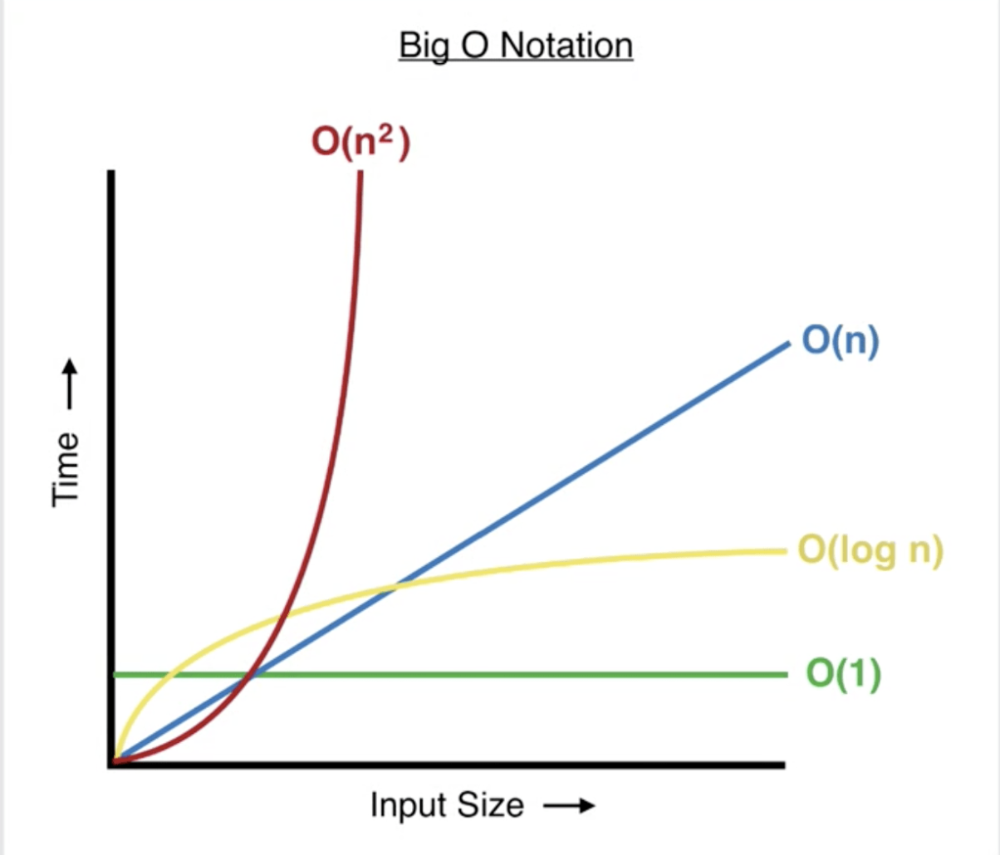

# Day 1: Introduction to Big O Notation

Let's say we were trying to solve a problem and we weren't sure which solution to choose. We might think about which solution is easier to code or understand, but we could also think about which solution runs faster. That last case is where Big O notation (calculating time complexity) comes in!

## What is Big O Notation?

Big O notation describes the amount of time it takes for a procedure to run relative to its input. For example, if the input is a string of one character: how long will it take? If the input is 1,000 characters, how long then?

It describes the runtime abstractly in terms of the input size and the number of operations that will occur, rather than milliseconds or other units of time. Specifically, it describes the way in which the runtime grows as the input grows. Here are some examples of what Big O notation looks like: O(n), O(1), O(n<sup>2</sup>). We'll get into what this means in a moment. For now, know that n refers to the size of the input or the input itself, e.g. the length of a string or an array or a value itself, such as an integer.

## Calculate for the Worst Case

Before we get technical, let's use going to the grocery store as an analogy for calculating time complexity.

### Grocery Store

So we're at the store looking for chocolate chips. The best case is that we walk in, and BAM, those chocolate chips are right there in front of us. The worst case is that we end up walking up and down every single aisle, until finally we find them. That last case is what we're interested in, and we could then describe our chocolate chip search in terms of the number of aisles in the grocery store: O(aisles), because our search time grows as the number of aisles grows. In other words, the amount of time it takes to find chocolatey morsels of goodness depends on the number of aisles in the store.

If there were 5 aisles, we could say O(5), but what if the grocery store added or removed aisles? We'd have to update our notation to the new value, e.g. O(20). This is why it's better to say O(aisles): it covers any number of aisles.

### Finding an Element in an Array

Let's say we have an unsorted array of elements and our function needs to find and return a specific element. That element could be at the 0th index or it could be at the last index or not in there at all, so we iterate over the array until we find it:

```
function findElement(arr, target):
  iterate over arr:
    if element == target:
      return true

  return false
```

We're interested in the worst case, which is when the element is not in the array. In that case we must iterate over the entire array before returning false. We can refer to the number of elements as n, which means Big O for this function is O(n). The time it takes to run directly relates to the array's length.

## Calculate for the Weakest Link

Big O does not concern itself with every little detail in a procedure. Instead, it cares most about the part of the procedure that will take the longest. In other words, we find the part that will take the longest (the weakest link) and calculate Big O for that part.

### Grocery Store

Let's think back to our chocolate chip hunt. We discussed walking the aisles to search for those sweet nuggets, but we didn't talk about going to the store or walking home. Let's pretend we live one minute away from the store, so walking there always takes one minute. The time it takes to walk the aisles, on the other hand, depends on where the chocolate chips are. We don't need to concern ourselves with the time it takes to walk because it's not the weakest link: it's always the same amount of time. Walking the aisles is the weakest link because it has the potential to take up the most time.

### Finding a Duplicate Element in an Array

Let's say we need to check if there's a duplicate of the 0th element in an array elsewhere in that same array. Our algorithm might look like this:

```
function findDuplicate(arr):
  zeroth_element = arr[0]

  iterate over arr starting at index 1:
    if element == zeroth_element:
      return true

  return false
```

We need not concern ourselves with the time it takes to grab the 0th element or return true or false - those tasks always take the same amount of time, and therefore, are not the weakest link. The weakest link is the iteration over the array, which depends on the length of the array, so it has the potential to take up the most time. If the array is one element long: great, it'll be super fast. But if it contains one million elements, that's going to take some time. Since the amount of time directly correlates with the length of the array (which we call n), Big O for this algorithm is O(n).

## Drop the Coefficients

When calculating time complexity, we don't concern ourselves with coefficients (the numbers that come before variables in mathematics, e.g. 2n or 5x). Let's look at a pseudocode example to see what this might look like:

```
function find_lowest_and_highest(arr):
  result = []
  result << iterate and find minimum in arr
  result << iterate and find maximum in arr

  return result
```

This code actually has two weakest links: iterating to find the maximum value and iterating to find the minimum value. Both of those procedures have a time complexity of O(n), since the minimum or maximum values could be at the end of the array in the worst case. We could say that the time complexity of find_lowest_and_highest is 2O(n), since the weakest link runs twice. However, Big O simply does not care about that, so we drop the coefficients and declare that this function runs in O(n) time.

## Common Time Complexities

It's a lot easier to calculate Big O if you know how the most common runtimes are defined. Please note that we aren't listing all of the possibilities here.

### Constant Time: O(1)

Constant time is the best time! Algorithms or procedures that run in O(1) time take the same amount of time to run regardless of the size of the input (like walking to the store to get chocolate chips). Some examples of constant time procedures include:

- Mathematical operations, such as adding or subtracting numbers
- Accessing an element in an array at a specific index, e.g. array[2]
- Accessing a value in a Hash (Object in JS, Dictionary in Python) using a key
- Returning a value
- Printing a value (e.g. to the console or command line)

As an example, it doesn't matter if you're accessing the 2nd or 1,000th element in an array when you're accessing it by its index number - it'll take the same amount of time either way!

```
function find_by_index(arr, index):
  print arr[index]
  return arr[index]
```

### Linear Time: O(n)

Linear time is also good. The runtime for algorithms that run in O(n) time is proportional to the size of the input, e.g. 1 x input size or 3 x input size. Earlier we mentioned that finding an item in an array takes O(n) time because the item could be at the very end or not in there at all, which means we must iterate over the length of the array in the worst case. Some examples of linear time procedures include:

- Iterating over an array, e.g. to find a target value
- Iterating over a string
- Printing each character or element of an array or string, respectively, one by one

```
function say_hi_to_everyone(names):
  iterate over names:
    print "hi " + name
```

### Quadratic Time: O(n<sup>2</sup>)

Quadratic time is not good, but sometimes unavoidable. The runtime is defined as the square of the input's size. For example, if we had a quadratic time algorithm that took an array as an input: for an input of length 1, there would be 1 operation, but for an input of length 10, there would be 100 operations. Some examples of algorithms that take quadratic time include:

- Bubble sort
- Selection sort
- Insertion sort
- Some algorithms that contain a loop nested in another loop

```
function nested_loop_quadratic_time(arr):
  iterate over arr:
    iterate over arr:
      perform some operation
```

In the above example, the outer loop iterates over the entire input array. For each element in the input array, it then iterates over the entire array again. For an array of length 2, there are 2 \* 2 (or 4) operations, but for an array of length 10, there are 10 \* 10 (or 100) operations.

### Logarithmic Time: O(log n)

Logarithmic time is fantastic! It's not quite as good as constant time, but it is faster than linear time. If an algorithm runs in O(log n) time, time increases linearly while the input increases exponentially. Let's pretend we have some operation that takes 1 second to handle an input containing 10 elements. When the input has 100 elements, that operation will take 2 seconds, and 1,000 elements will take 3 seconds! That's fast!

An algorithm may be logarithmic if:

- The weakest link always runs less than n times
- Each time the input is operated upon, the size of the input is divided by some number

An example of an O(log n) algorithm is:

- Binary search

```
function useless_log_n_loop(arr):
  n = length of arr

  while n > 0:
    print arr[n]
    n = n / 2
    round down n to nearest integer
```

### Graph of Common Time Complexities



## Need to Know

When we calculate Big O for a procedure, there are some runtimes we just need to know (or look up). For example, it's important to know the runtime for accessing an element in an array or accessing a value in a Hash (aka Object or Dictionary). Take some time to review this [resource](https://www.bigocheatsheet.com/) (bookmark it!), which includes the best, average, and worst case time complexity for common operations and algorithms. For now, the most important data structures to pay attention to are arrays and hash tables.

## Note on Recursion

When calculating Big O for recursive functions, we compare the total stack frames over time to the size of the input.

```
function count(stop_count, count = 0):
  if count >= stop_count:
    return 'done'

  return count(stop_count, count + 1)
```

For the above function the total number of frames added to the stack over time is directly proportional to the `stop_count`, so Big O is O(n). 

## Conclusion

Calculating Big O for a procedure can help you decide between several solutions or improve a solution you've already thought of. It takes time and practice to get used to Big O notation. In the coming days, we'll be asking you to calculate the time complexity for problems you've already solved. We'll also show you our own calculations to help you along.
