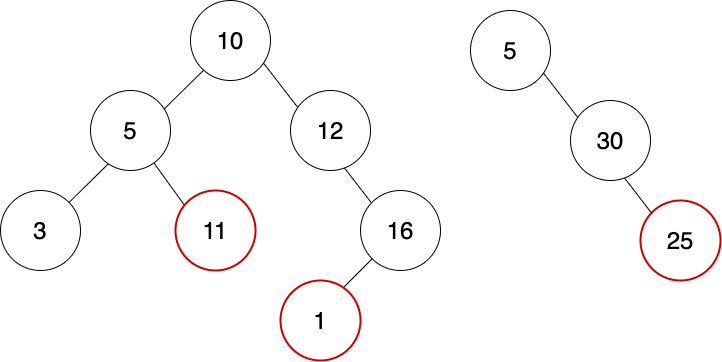

# Day 4: What Is a Binary Search Tree?


A binary search tree (BST) is a data structure consisting of nodes: it's called a Binary Search Tree because each node has at most two child Nodes and because its nodes are arranged in a specific order that makes it possible to search quickly.

Each node has two attributes, often called `left` and `right`, and an additional attribute that stores the `value` of that node. The `left` Node contains a `value` less than the parent node, and the `right` node contains a value that is greater than or equal to the parent node. Any node that has at least one child node is called a parent node, and any node that doesn't have any children is called a leaf node. The node at the top of the tree is called the root node.

```
left_node = new Node(1)
=> Node with value 1, left is null or nil, right is null or nil

right_node = new Node(3)
=> Node with value 3, left is null or nil, right is null or nil

// Both left_node and right_node are leaf nodes since they have no children

root_node = new Node(2, left_node, right_node)
=> Node with value 2, left is Node with value 1, right is Node with value 3
// This is the top of the tree, so it is the root, and because it has children, it's also a parent node
```

It is important to note that a BST is not the same as a binary tree. A BST is a type of binary tree that follows specific rules, such as the ability to traverse it in such a way that its nodes' values are output in sorted order. A binary tree, in contrast, can have nodes that are in no specific order whatsoever.

```
bst_in_order_traversal(bst_root)
=> [-1, 3, 5, 10]

binary_tree_in_order_traversal(bt_root)
=> [10, -20, 3, 0, 7]
```

## Important Terms

- root: The top node of the tree, the one where we begin traversing the tree (similar to the zeroth element in an Array). May or may not have children.
- parent: Any node that has at least one child, i.e. its `left` or `right` attribute, or both, point to another node.
- left: An attribute on every node in the tree. The node will have a value lesser than its parent. If it doesn't point to another node, it will be null or nil or some other falsy value.
- right: An attribute on every node in the tree. The node will have a value greater than or equal to its parent. If it doesn't point to another node, it will be null or nil or some other falsy value.
- leaf: A node that has no children.
- subtree: Any time we see a parent node, other than the root node, we can refer to that node and all that branch off of it as a subtree. This is similar to how you think of a portion of an Array as a subset of that Array.

## BST Rules

For a BST to be valid, it must adhere to certain rules:

1. Each node has a maximum of two children (`left` and/or `right` nodes).
2. Every parent node contains a value that is greater than the value of its `left` node and less than the value of its `right` node.
3. All nodes of a left subtree are less than the root node.
4. All nodes of a right subtree are greater than the root node.
5. All subtrees are also valid BSTs. This is just another way of rephrasing points 3 and 4 above.

It's important to note that a tree with only a root node is considered valid. An empty tree is also valid - weird, but true.

```
root = new Node(7)
is_valid_bst(root)
=> true

is_valid_bst(null)
=> true

is_valid_bst("If this is true, then I've gone bananas!")
=> false
// guess we've not gone bananas!
```

### Examples of Valid BSTs


Both of these binary trees are valid BSTs.

The left tree is valid because:

- Every node value to the left of the root is less than the value of the root. Every node value to the right of the root is greater than the root's value.
- The same is true for all subtrees. For example, if we start at the node with value 5, the node to its left is less than 5 and the node to its right is greater than 5.

The right tree is valid because:

- All of the nodes to the right of the root (value 5) are greater than the root.
- As we go down the right side, each right node is greater than its parent node.

### Examples of Invalid BSTs



Both of these trees are invalid BSTs.

The left tree is invalid because:

- The node with value 11 is greater than the root node with value 10. The node with value 11 is to the left of the root and needs to be less than 10 and greater than 5.
- The node with value 1 is less than the root node. Since it's on the right side of the tree, it needs to be greater than 10 and less than 16. If we consider the node 12 and all of its child nodes as a subtree, then we also notice that the node with value of 1 needs to be greater than 12. In summary, this misplaced node needs to be greater than 12 and less than 16.

The right tree is invalid because:

- The node with value 25 is to the right of the node with value 30, meaning that its value must be greater than 30.

## Implement a BST

For this challenge, we'll be creating the `Node` class with the appropriate attributes and then we'll manually create valid BSTs to ensure that we understand the rules of BSTs. Our tests will check that your manually created BSTs are valid. We will not be creating a parent class to track the `root`.

Use the language of your choosing. We've included starter files for some languages where you can optionally pseudocode, explain your solution and code.

**_Feel free to run our tests whenever you like for this challenge! It can be hard to validate a BST on your own, especially if you're a newbie._**

### Create the `Node` class

A `Node` should have three attributes: `left`, `right`, `value`. When initializing a new Node, it should take three arguments: `value`, `left`, and `right`.

When a new `Node` is initialized without a `left` node, `left` should be set to an appropriate falsy value by default. The same applies to the `right` node. Expect that every `Node` will be initialized with a `value`.

```
node = new Node(7)
=> Node: value = 7, left = null / nil, right = null / nil

left = new Node(4)
right = new Node(10)
root = new Node(7, left, right)
=> Node: value = 7, left = Node with value 4, right = Node with value 10
```

### Manually Create Valid BSTs

Let's manually create some BSTs using the `Node` class we just declared. For this part, we'll have several methods with unique names, and it'll be your job to create the BST and return the `root` node. Our tests will then traverse the tree and determine if it's valid.

You will be given an Array of values in sorted order, which you'll use to create your tree. Drawing the tree on paper can make it easier to understand how the nodes connect to one another. Be aware, that there is almost always more than one way to create a valid BST from a list of values. You get to decide how! In other words, you get to decide which node in the list to use as the root.

Example:

```
list = [1, 2, 3]
/* i want my tree to look like this:
       2
    1     3
*/

function one_to_three_bst() {
  left = new Node(1)
  right = new Node(3)
  root = new Node(2, left, right)

  return root
}
```

You can find the methods and their accompanying lists in the starter files.

## Before you start coding:

1. Rewrite the problem in your own words
2. Validate that you understand the problem
3. Write your own test cases
4. Pseudocode
5. Code!

**_And remember, don't run our tests until you've passed your own!_**

## How to run your own tests

### Ruby

1. `cd` into the ruby folder
2. `ruby <filename>.rb`

### JavaScript

1. `cd` into the javascript folder
2. `node <filename>.js`

## How to run our tests

### Ruby

1. `cd` into the ruby folder
2. `bundle install`
3. `rspec`

### JavaScript

1. `cd` into the javascript folder
2. `npm i`
3. `npm test`
