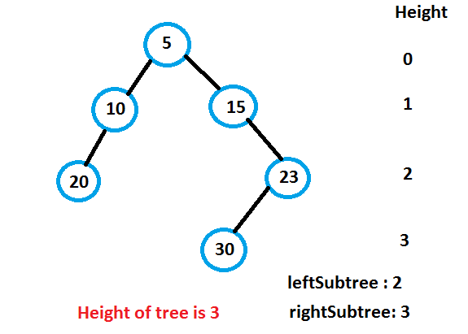
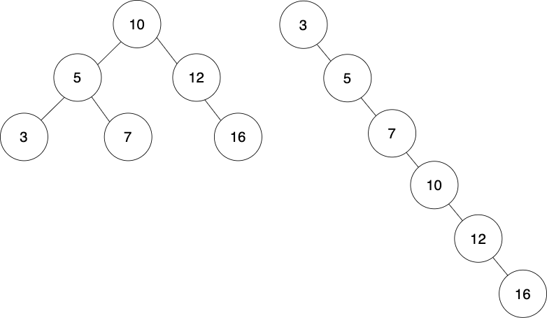

# Day 5: Balanced and Unbalanced Binary Trees


Binary trees can be balanced or unbalanced. In the image above, the left tree is balanced, while the right tree is unbalanced. For the left tree, the left subtree is the same height as the right subtree, making it balanced. For the right tree, there is only a right subtree, making it unbalanced.

## How to Calculate the Height of a Tree

We can look at a visualization of a tree and intuitively determine whether its left and right subtrees are the same height, much the same way as we determine whether two people are the same height. But, when it comes to trees, we actually have a more specific definition of height and it can be measured numerically, just like your own height!



For a binary tree, the height is defined as the distance from the root node (where the tree starts) to the furthest leaf node (a node without any children). To calculate the height we count up the layers (or depth) of nodes (not all of the nodes), and then subtract 1, since we aren't supposed to include the root node in the height. This means that the height for both trees in the image at the top of this reading is 2.

## How to Determine If a Tree Is Balanced or Unbalanced

A tree is considered balanced if its right subtree and left subtree are the same height or they have a difference of 1. All other trees are unbalanced. Here are two examples of balanced trees:

```
    0             10
   / \           /  \
-10   20        0    20
                     /
                   19
```

Visually, it is quite easy to determine whether a tree is balanced or not. We look at the left and right sides and can almost immediately tell that they're the same, or roughly the same, height. In code, however, we have to traverse the left subtree and determine its depth, and then traverse the right subtree and determine its depth. Lastly, we compare those depths. We won't be coding this today, but we will be revisiting this in a later challenge.

## Why Should We Balance a Tree?



Take a look at the two trees above. Let's imagine that we want to see if the value 16 is in these trees.

For the left tree, which is balanced, we can do the following:

- Go to 10.
- Is 10 more or less than 16? It's less!
- Go right, to 12.
- Is 12 more or less than 16? It's less!
- Go right, to 16! found it.

Notice that we didn't have to visit the left subtree at all, which means this algorithm would have a Big O run time of less than O(n)! We'll let you think about what the specific run time might be :) Or Google it. Or if you're familiar with the binary search algorithm, does this remind you of that? (Shh, writer, you're giving the answer away!)

For the right tree, which is unabalanced, we have to visit every single node before we get to 16. This has a Big O run time of O(n), which is not as good as the balanced tree.

So why do we want to aim for balanced trees!? All together now: To save time! (<- You can scream it in your head if you want, or out loud. You do you.)

## Practice Building Balanced Trees Manually

For practice, let's manually build balanced trees from lists. We'll include several methods in the starter files which you'll fill out. For each method, return the root node. Our tests will then check if the tree is balanced or unbalanced, and if it's a valid BST. Remember, a tree is balanced if the left and right subtrees have a height difference of 0 or 1. Note that there may be more than one way to create a balanced BST from the lists.

Example:

```
list = [1, 2, 3]
/* i want my tree to look like this:
       2
    1     3
*/

function one_to_three_bst():
  left = new Node(1)
  right = new Node(3)
  root = new Node(2, left, right)

  return root
```

Use the language of your choosing. We've included starter files for some languages where you can optionally pseudocode, explain your solution and code.

## Before you start coding:

1. Rewrite the problem in your own words
2. Validate that you understand the problem
3. Write your own test cases
4. Pseudocode
5. Code!

**_And remember, don't run our tests until you've passed your own!_**

## How to run your own tests

### Ruby

1. `cd` into the ruby folder
2. `ruby <filename>.rb`

### JavaScript

1. `cd` into the javascript folder
2. `node <filename>.js`

## How to run our tests

### Ruby

1. `cd` into the ruby folder
2. `bundle install`
3. `rspec`

### JavaScript

1. `cd` into the javascript folder
2. `npm i`
3. `npm test`
