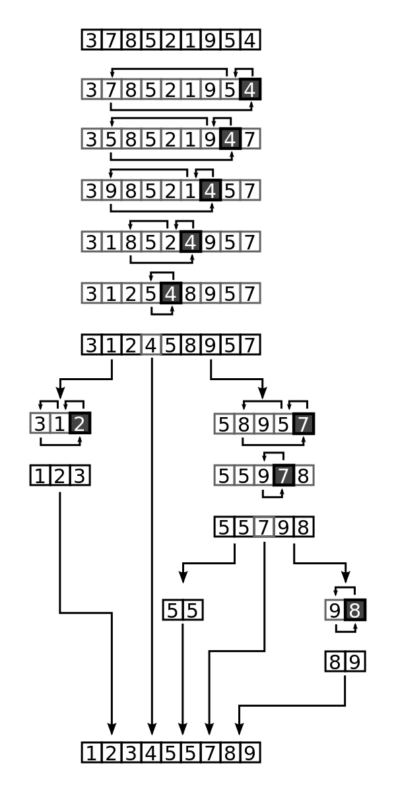

# Bonus: Quicksort


Quicksort is an efficient divide and conquer algorithm for sorting data. It can sort in place, i.e. it does not require us to push data to a new data structure, and it's typically implemented as a recursive algorithm. Note that there are a number of ways to implement a quicksort.

## How Does Quicksort Work?

The quicksort algorithm requires us to choose a pivot element in the array. The pivot can be at any point, such as the start, middle, or end. Next, we sort all of the elements that are less than the pivot to the left of the pivot, and all of the elements that are greater than the pivot to the right. Once this is done, the pivot is at the correct location. We then repeat this process on the left and right sides until the whole list is sorted.

In the diagram below, notice how the number 4, which is the pivot, is sorted to the correct location before the recursive call is made (branching denotes the recursive calls). First, we check if 1 is more than 4. It isn't so we move to the next value: 7. 7 is more than 4, so it is swapped with the element before 4 (which is 5), and 4 is then swapped with 7. This continues until every element before the pivot has been evaulated.



## Performance

In the worst case, quicksort runs in quadratic time: O(n^2). This will happen when we choose the rightmost element as the pivot for an already sorted list. The average run time, however, is logarithmic: O(n log n).

We can improve the performance of our quicksort algorithm by choosing the middle element as the pivot instead. We can potentially gain further improvements by sampling three or more elements and choosing the median as the pivot. However, choosing too many elements for sampling will likely degrade performance, so it really is a balancing act.

## Implement Quicksort

We'll implement the quicksort algorithm in two parts. First we'll make the helper function that sorts elements to the right or left of the pivot. Once that's working, we'll work on the main function that calls the helper function. Our tests will test the main function. It'll be up to you to ensure the helper function works.

### 1. `partition(array, low, high)`

The helper method `partition` takes three arguments: the `array` to operate upon, and a `low` and a `high`, which are integers denoting which portion of the array requires sorting. It returns the final index of the pivot element and performs the following operations:

1. Choose the rightmost element as the pivot
2. Declare a variable called `pivotIndex` or `pivot_index` and set it equal to the value of `high`
3. Iterate over the array starting at the `low` index and ending at the `pivotIndex`
   - If an element to the left of the pivot is less than or equal to the pivot, continue
   - If an element to the left of the pivot is greater than the pivot:
     - Swap it with the element just before the pivot, and then swap the pivot with that element (i.e. the pivot will now be at its original index - 1)
     - Decrement the `pivotIndex`, since the pivot has been moved to the left by one place
   - If an element is equal to the pivot, leave it in place
4. Return the `pivotIndex`

Your function should sort the array in place. This means you should not be creating a new array at any point. You'll also need to decide how to best iterate over the array. Think about which element needs to be compared to the pivot at any given time.

```
array = [3, 2, 1, 4]
partition(array, 0, 3)
=> 3
// array = [3, 2, 1, 4]

array = [3, 2, 1, 2]
partition(array, 0, 3)
=> 2
// array = [1, 2, 2, 3]

array = [2, -10, 7, 0, 1, 3]
partition(array, 0, 5)
=> 4
// array = [2, -10, 1, 0, 3, 7]

array = [2, -10, 7, 0, 1, 3]
partition(array, 1, 3)
=> 2
// array = [2, -10, 0, 7, 1, 3]
```

To determine whether your function is working, check if all elements lower than the pivot are to the pivot's left, while all elements greater than the pivot are to its right. Be sure to look at the correct subset of the array when using values other than 0 and the array's length - 1 as the `low` and `high`. Finally, the method will return the final index of the pivot element.

### 2. `quicksort(array, low, high)`

This is the main method that returns a sorted array. Once again, it sorts the array in place - it does not create any new arrays. It achieves this by partitioning the array using the helper method from earlier, and then recursively processing all elements to the left of the pivot and all elements to the right of the pivot. The steps are:

1. If `low` is less than `high`
   - Partition the array using the `low` and `high` values
   - Store the result of calling `partition` in a variable (recall that the result is the final index of the pivot)
   - Recurse with the left side of the array (use `low` and `high` to specify the starting and stopping points)
   - Recurse with the right side of the array (use `low` and `high` to specify the starting and stopping points)
2. Else return the array

```
arr = [3, 2, 1, 4]
quicksort(arr, 0, 3)
=> [1, 2, 3, 4]

arr = [1, 2, 2, 3, 4]
quicksort(arr, 0, 4)
=> [1, 2, 2, 3, 4]
```

### Bonus: Reduce the Number of Swaps

Our algorithm for `partition` always performs two swaps when a number higher than the pivot is encountered. Can you modify the algorithm so that it performs only one swap in this case? It should then perform one final swap to put the pivot in the correct location before returning the pivot index. Take a look at the gif at the top of this README if you need to see it in action.

### Super Bonus: Choose the Middle Element as the Pivot

Can you modify the algorithm to use the middle element as the pivot? There's more than one way to achieve this functionality! What about using the median of several values? Or a random element?

Use the language of your choosing. We've included starter files for some languages where you can pseudocode, explain your solution and code.

## Before you start coding:

1. Rewrite the problem in your own words
2. Validate that you understand the problem
3. Write your own test cases
4. Pseudocode
5. Code!

**_And remember, don't run our tests until you've passed your own!_**

## How to run your own tests

### Ruby

1. `cd` into the ruby folder
2. `ruby <filename>.rb`

### JavaScript

1. `cd` into the javascript folder
2. `node <filename>.js`

## How to run our tests

### Ruby

1. `cd` into the ruby folder
2. `bundle install`
3. `rspec`

### JavaScript

1. `cd` into the javascript folder
2. `npm i`
3. `npm test`
