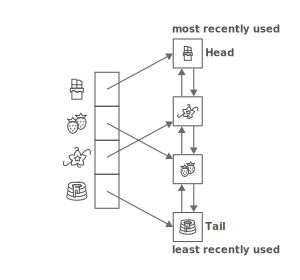

# Days 3 to 5: LRU Cache

A Least Recently Used (LRU) Cache is a data structure that organizes items in order of use or access from most recently accessed to least recently accessed. It has a fixed length or is allowed to take up a maximum amount of space in memory, i.e. there is a limit to the number of items it contains. You can think of it as being similar to items in a kitchen cabinet: the items you use most often will likely be easy to see and within reach when you open the cupboard. The items you use less often will be behind those items, and the items you use least may be completely out of reach.

## Why Use an LRU Cache?

The short story is that it's faster to read data from a cache (such as on the RAM) than it is to read it from a database or hard disk. Since there is a limit to how much data we can cache, we have to come up with a system to determine which data stays and which data gets evicted from the cache. With an LRU cache, we evict the least recently used data once the cache is full. If you'd like the long story, carry on reading this section.

Let's say we have a website where users can access many different stories. Our website gets a lot of traffic, and each visit results in a request to the database for a story. The responses to these requests are becoming slower and slower since accessing the database is expensive. We look at which stories our users are accessing most often and notice that there are 10 stories that most users access and those specific stories shift over time, i.e. the popular stories at 5PM differ from the popular stories at 10PM. This means we can cache this data, or these stories, on the server. When we do this, requests for these stories will not result in database requests. Instead, they will be quickly retrieved directly from the server's memory.

We decide to implement an LRU cache! When a user makes a request for a story, we check if it's in the cache. If it is, we respond with that story and reorder the data in our cache to reflect that the story was the most recently accessed. If the story isn't in the cache, we make the request to the database, and then place the story in the correct place within the LRU cache. If the cache is full, we also remove the least recently accessed story from it.

## Trade Offs

The typical design of an LRU cache allows for extremely fast access: checking if an item is in the cache is a constant time O(1) operation. Updating the cache is also extremely fast: O(1).

However, the trade off is the amount of space required to store the data. An LRU cache often uses two data structures - a doubly linked list and hash map - to store the data in the correct order. This means it takes up more space than using a simpler data structure, such as an Array. Note that it is possible to implement an LRU cache with different data structures.

## Why Two Data Structures?

The LRU cache requires its data to be ordered. It also requires fast access and updating (insertion and deletion). Let's say we used an Array, since it's ordered. We only have fast access if we know the index of the element we're looking for in the Array, and our program is unlikely to have that information. Similarly, inserting elements at the front of an Array is an O(n) operation, so we can't use an Array for an LRU cache.

We could also think about using a hash/object, but hashes are not ordered, so we have another problem here. However, they do provide O(1) access when you know the key for the value you're looking for. It is also extremely fast to add and remove key-value pairs from a Hash. We could also think about using a doubly linked list (a doubly linked lists contains nodes that point to the next node and previous node). Linked lists are ordered and they allow for fast insertion and deletion. However, finding a specific item takes O(n) time, since we must traverse the list.

When we combine a hash with a doubly linked list, we get the best of both worlds: constant-time access, insertion, and deletion! ...as long as we design our LRU cache properly that is.

## How Do We Combine These Data Structures?



It's easier to think about how these data structures work together if we first set up some rules:

- When we check if an item is in the cache, we always check if it's in the hash
- A key in the hash always points to a node in the doubly linked list
- Items in the doubly linked list are always ordered from most recenlty used (at the head) to least recently used (at the tail)
- If an item is being added to a cache that's full, the least recently used item is removed from both the hash and list (at the tail)
  - The list tells us which item was least recently used since it will always be at the tail
- If an item is being retrieved from the cache, it is moved to the head of the list and the hash remains unchanged

Let's say we start with an empty cache. We want the recipe associated with an item that has an ID of "cake". First, we check if "cake" is in the cache by asking the hash if it has a key of "cake". The cache is empty, so the data is retrieved from the database. Next, the LRU cache creates a new node, which stores the recipe. The node is added to the doubly linked list as its head and tail since the list contains only one item. Next, a key of "cake" is added to the hash, and its value is set to the node that was just created. At the end of this operation we have a list with a single node in it, and a hash with a key of "cake" pointing to that node.

```
lru_cache.hash
=> {
  "cake": Node storing "cake"s recipe
}

lru_cache.list
=> Doubly Linked List with head and tail both pointing to "cake" recipe Node
```

Now another user comes along asking for "cake". We check the cache's hash for "cake". It's there, so we retrieve its value and send it to the user. We don't need to do anything else because "cake" is already the most recently accessed item in the cache.

Next a user asks for "cookies". We check the hash, but it's not in there, so we retrieve the recipe from the database. Next, we create a node using the "cookies" data and set that node as the head of the doubly linked list, since it's the most recently accessed item. This means that "cake" is now the tail. Lastly, we add a key of "cookies" to the hash and have it point to the node.

```
lru_cache.hash
=> {
  "cake": Node storing "cake"s recipe,
  "cookies": Node storing "cookie"s recipe
}

lru_cache.list
=> Doubly Linked List with head pointing to "cookies" Node and tail pointing to "cake" Node
```

Let's pretend our cache can only store two recipes. This means our cache is full! A user comes along and asks for an omelette recipe. The LRU Cache's hash doesn't have an "omelette" key, so the data is retrieved from the database. A node is created using the omelette data. The cache goes to add it to the head of the list, but the list is full, so it kicks out "cake", which is at the tail. The omelette node is then added as the head of the list, and a key is created in the hash which points to the omelette node.

```
lru_cache.hash
=> {
  "cookies": Node storing "cake"s recipe,
  "omelette": Node storing "omelette"s recipe
}

lru_cache.list
=> Doubly Linked List with head pointing to "omelette" Node and tail pointing to "cookies" Node
```

## Implement an LRU Cache

We'll take this slow: first we'll create our Doubly Linked List class, and then we'll move on to creating the LRU Cache. For the Doubly Linked List class, we'll only worry about creating the methods required for our cache to work. Note that our tests will only check if the cache is functioning correctly. It'll be up to you to test that the list is working correctly.

The Node class has already been filled out. It contains four attributes: `data`, which stores some kind of value, `key`, which stores the associated key name in the hash, `next`/`next_node`, which points to the next node in the list, and `prev`/`prev_node`, which points to the previous node in the list.

### Implement the Doubly Linked List

As you implement each of these methods, make sure you're correctly updating each Node's `next` and `prev` attributes. Also keep in mind that each of these operations should take constant time: O(1).

You may assume that only valid inputs will be provided to each method. For example, if you're asked to move a node to the head of the list, it's guaranteed that the argument will contain a node and that the node will be in the list already.

#### 1. `addHead(node)` / `add_head(node)`

Place the given node at the head of the list. Do not remove the existing head if there is one!

```
list = new DoublyLinkedList
list.add_head(node1)
list.head
=> node1

list.add_head(node2)
list.head
=> node2

list.head.next
=> node1

list.tail
=> node1
```

#### 2. `removeTail()` / `remove_tail`

Remove the tail from the list and return it.

```
list = new DoublyLinkedList
list.add_head(node1)
list.head
=> node1

list.tail
=> node1

list.remove_tail()
=> node1

list.tail
=> null or nil
```

#### 3. `removeNode(node)` / `remove_node(node)`

Remove the given node from the list and return it.

```
list = new DoublyLinkedList
list.add_head(node1)
list.add_head(node2)
list.add_head(node3)
// list is 3 -> 2 -> 1

list.remove_node(node2)
=> node2
// list is 3 -> 1
```

#### 4. `moveNodeToHead(node)` / `move_node_to_head(node)`

Move the given node to the head of the list.

```
list = new DoublyLinkedList
list.add_head(node1)
list.add_head(node2)
list.add_head(node3)
// list is 3 -> 2 -> 1

list.move_node_to_head(node2)
// list is 2 -> 3 -> 1
```

### Implement the LRU Cache

Now that we have our list ready for use, we can implement the LRU Cache! Our cache will contain only two methods (one to get data and another to add it), but you can add helper methods if you need to. The necessary attributes - `limit`, `size`, `hash`, and `list` - have already been added to the cache. The `limit` is set to a default value, which can be overridden when instantiating a new cache. It sets the maximum number of items allowed in the cache. The `size` tracks the total number of items currently in the cache. The `hash` and `list` point to the hash/object and Doubly Linked List that store the cache's data.

As you work on the cache, remember that you'll also need to determine when and where to update the `size` of the cache. Also keep in mind that our operations need to run in constant time.

You may assume that the methods will only be given valid arguments.

#### 1. `get(key)`

Return the item from the cache using the given `key`. If the item is in the cache, move it to the head of the list to denote that it is the most recently accessed item. If the item isn't in the cache, return `-1`.

```
lru_cache.get("potato")
=> Node with data associated with "potato"

lru_cache.get("notato")
=> -1
```

#### 2. `put(key, value)`

Add or update the item in the cache. If the key does not exist in the cache, add the item to the cache. If the key is in the cache, update the item with the value. In any case, move the item to the head of the list to denote that it's the most recently accessed item. If the cache is already full, remove the least recently used item from the cache before adding the new item.

```
lru_cache = new LRUCache(3)
lru_cache.put("cake", "cake recipe")

lru_cache.get("cake")
=> Node with data "cake recipe"

lru_cache.put("cookies", "cookie recipe")
lru_cache.put("cake", "fixed cake recipe")
lru_cache.put("scones", "scone recipe")
lru_cache.put("smoothie", "smoothie recipe")

lru_cache.get("cake")
=> Node with data "fixed cake recipe"

lru_cache.get("smoothie")
=> Node with data "smoothie recipe"

lru_cache.get("cookies")
=> -1
// cookies got kicked out when smoothie was added because the cache was full
```

Use the language of your choosing. We've included starter files for some languages where you can pseudocode, explain your solution and code.

## Before you start coding:

1. Rewrite the problem in your own words
2. Validate that you understand the problem
3. Write your own test cases
4. Pseudocode
5. Code!

**_And remember, don't run our tests until you've passed your own!_**

## How to run your own tests

### Ruby

1. `cd` into the ruby folder
2. `ruby <filename>.rb`

### JavaScript

1. `cd` into the javascript folder
2. `node <filename>.js`

## How to run our tests

### Ruby

1. `cd` into the ruby folder
2. `bundle install`
3. `rspec`

### JavaScript

1. `cd` into the javascript folder
2. `npm i`
3. `npm test`
