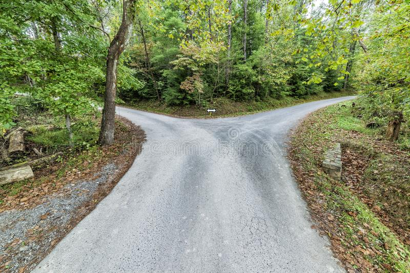

# Days 2 to 3: Depth-First Graph Traversal



For this challenge we'll be determining whether there is a path from vertex A to vertex B in a graph. We'll do this using depth-first traversal, which is typically a recursive process. During a depth-first traversal, we explore a path completely before going down another path. It's like exploring a fork in a road on foot: you walk all the way down one side of the fork, then walk back up to where you started, and then go down the other side before walking back up again.

## Our Graph

For this challenge, we'll be using a directed disconnected graph stored in a hash/object where each key maps to an adjacency list. Let's break down that word jumble:

- Directed graph: Starting at any vertex, we can travel in only one direction, e.g. we can go from vertex A to vertex B but not from B to A. This is similar to a Linked List. The difference, however, is that we can connect any two vertices we like, e.g. A -> B -> C -> A, and a vertex may be connected to many other vertices.
- Disconnected: It is possible that certain vertices might be unreachable from another vertex. E.g. we can go from A to B, but there is no path from A to C.
- Adjacency list: A list of vertices that share an edge with a given vertex, i.e. there is a direct connection from the given vertex to every vertex in the adjacency list.

Example:


```
graph = {
  jan: ["john", "jambaby"],
  john: ["carl"],
  jambaby: [],
  carl: ["jambaby"],
  dave: []
}
```

In this graph, jan can travel to carl via john, but jambaby can't visit anyone and neither can dave. Similarly, no one can visit dave, who's just floating in space all by their lonesome. Sorry dave.

## Implement isPath(graph, vertexA, vertexB) / is_path(graph, vertex_a, vertex_b)

Your method will be given a graph stored in a hash/object. Each key represents a vertex in the graph, and each value will be a list of adjacent vertices stored in an array. The method will also be passed two vertices. Your job is to determine whether there is a path between them. If there is, return `true`, otherwise `false`. The vertices given will always be in the graph, and the graph will always be valid and contain data.

```
graph = {
  jan: ["john", "jambaby"],
  john: ["carl"],
  jambaby: [],
  carl: ["jambaby"],
  dave: []
}

is_path(graph, "jan", "carl")
=> true

is_path(graph, "jan", "dave")
=> false
```

Use the language of your choosing. We've included starter files for some languages where you can pseudocode, explain your solution and code.

## Before you start coding:

1. Rewrite the problem in your own words
2. Validate that you understand the problem
3. Write your own test cases
4. Pseudocode
5. Code!

**_And remember, don't run our tests until you've passed your own!_**

## How to run your own tests

### Ruby

1. `cd` into the ruby folder
2. `ruby <filename>.rb`

### JavaScript

1. `cd` into the javascript folder
2. `node <filename>.js`

## How to run our tests

### Ruby

1. `cd` into the ruby folder
2. `bundle install`
3. `rspec`

### JavaScript

1. `cd` into the javascript folder
2. `npm i`
3. `npm test`
