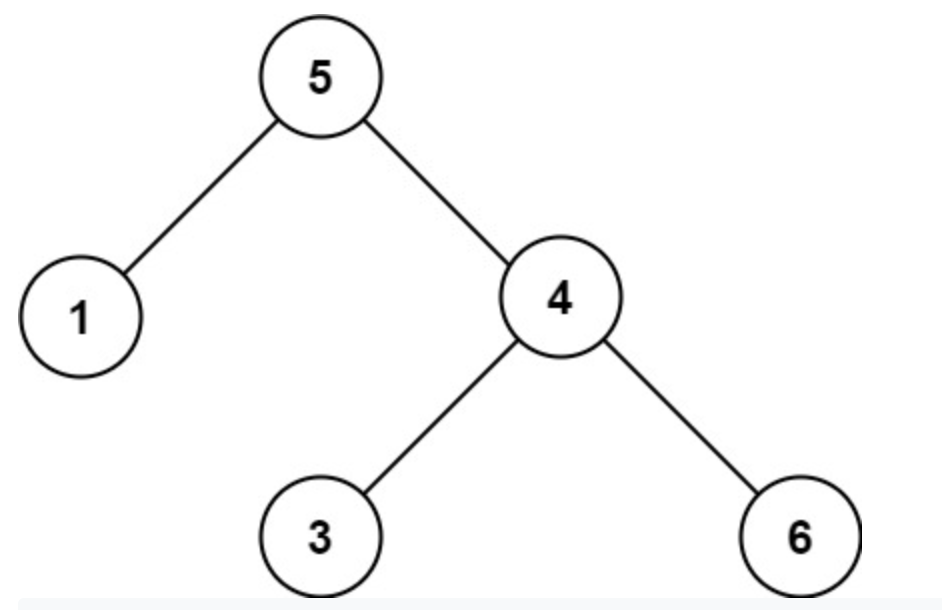
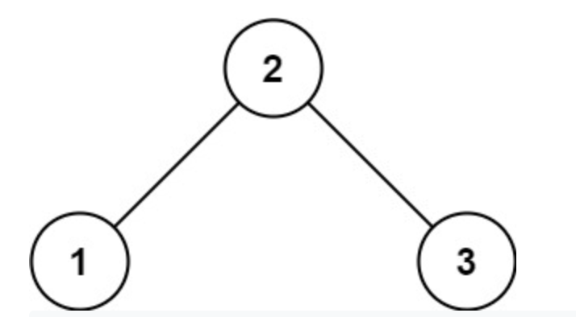

# Day 3-5: Validate Binary Search Tree

Given the root of a binary tree, determine if it is a valid binary search tree (BST).

A valid BST is defined as follows:

- The left subtree of a node contains only nodes with keys less than the node's key.
- The right subtree of a node contains only nodes with keys greater than the node's key.
- Both the left and right subtrees must also be binary search trees.

### Example 1:

Input: root = [2,1,3]

Output: true

### Example 2:

Input: root = [5,1,4,null,null,3,6]

Output: false

Explanation: The root node's value is 5 but its right child's value is 4.

## Before you start coding:

1. Rewrite the problem in your own words
2. Validate that you understand the problem
3. Write your own test cases
4. Pseudocode
5. Code!

**_And remember, don't run our tests until you've passed your own!_**

## How to run your own tests

### Ruby

1. `cd` into the ruby folder
2. `ruby <filename>.rb`

### JavaScript

1. `cd` into the javascript folder
2. `node <filename>.js`

## How to run our tests

### Ruby

1. `cd` into the ruby folder
2. `bundle install`
3. `rspec`

### JavaScript

1. `cd` into the javascript folder
2. `npm i`
3. `npm test`
